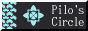
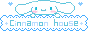
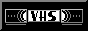
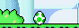

<h1>🎫 88x31 Collection</h1>

This is my <a href="https://indieweb.org/88x31" target="_blank">88x31</a> collection, because I can't help but collect things. It's not like many collections, I've curated it very specifically and each one means something special. Click one to visit its original site.

<i>Link me on your site!</i>

<button class="copy-btn" data-copy=''>Copy Embed Code!</button>

<!-- TEMPLATE
  
-->

<h3>Favourites</h3>

  <!-- jshmnrd    15/05/2026 -->
  
  <!-- NotByAI    15/05/2026 -->
  
  <!-- Canadian on the Web -->
  
  <!-- IndieWeb   15/05/2026 -->
  
  <!-- Hugo       15/05/2026 -->
  
  <!-- I am Canadian -->
  </a>
  <!-- Powered by Dr. Pepper  15/05/2026 -->
  
  <!-- ADHD       15/05/2026 -->
  
  <!-- Eh? -->
  
  <!-- Miku Approved -->
  </a>
  <!-- Pizzza -->
  
  <!-- Zimbabew -->
  

<h3>Movements / Causes / Beliefs</h3>

  <!-- Anything but Chrome -->
  
  <!-- I Hate Squarespace -->
  
  <!-- Not By AI -->
  
  <!-- Right to Repair -->
  
  <!-- Stop Killing Games -->
  
  <!-- Ukraine -->
  

<h3>People</h3>

  <!-- Benji Dog -->
  
  <!-- James' Coffee Blog -->
  
  <!-- Hellnet.work -->
  
  <!-- Pilosophos -->
  
  <!-- Scott Games -->
  

<h3>Tools & Websites</h3>

  <!-- DaFont -->
  
  <!-- Internet Archive -->
  
  <!-- Mastodon -->
  
  <!-- SCP -->
  
  <!-- Firefox -->
  
  <!-- Get Firefox -->
  
  <!-- GitHub -->
  
  <!-- Newgrounds -->
  
  <!-- Notepad++ -->
  
  <!-- VSCode -->
  
  <!-- Wikipedia -->
  

<h3>Cinnamoroll!</h3>

  <!-- Cinnamoroll 01  15/05/2026-->
  
  <!-- Cinnamoroll 02  15/05/2026-->
  
  <!-- Cinnamoroll 03  15/05/2026-->
  
  <!-- Cinnamoroll 04  15/05/2026-->
  
  <!-- Cinnamoroll 05  15/05/2026-->
  
  <!-- Cinnamoroll 06  15/05/2026-->
  
  <!-- Cinnamoroll 07  15/05/2026-->
  
  <!-- Cinnamoroll 08  15/05/2026-->
  
  <!-- Cinnamoroll 09  15/05/2026-->
  
  <!-- Cinnamoroll 10  15/05/2026-->
  
  <!-- Cinnamoroll 11  15/05/2026-->
  
  <!-- Cinnamoroll 12  15/05/2026-->
  
  <!-- Cinnamoroll 13  15/05/2026-->
  
  <!-- Cinnamoroll 14  15/05/2026-->
  
  <!-- Cinnamoroll 15  15/05/2026-->
  

<h3>Games</h3>

  <!-- Minecraft -->
  
  <!-- Terraria -->
  

<h3>Other</h3>

  <!-- Have a Smile -->
  
  <!-- White Monster -->
  
  <!-- Join Discord -->
  <!--  -->
  <!-- Domo -->
  
  <!-- Graveyard -->
  
  <!-- Glizzy -->
  
  <!-- Kool Aid -->
  
  <!-- Korn -->
  
  <!-- MP3 -->
  <audio id="aah" src="aah.ogg"></audio>
  
  <!-- RSS -->
  
  <!-- Star Wars -->
  
  <!-- Powered by the void -->
  
  <!-- Twitter -->
  
  <!-- VHS -->
  
  <!-- Webkinz -->
  
  <!-- Windows XP -->
  
  <!-- Yoshi Hatch -->
  

<!-- TEMPLATE
  
-->

<i>More to come!</i>

<!-- white-monster https://www.tumblr.com/michaelmurder/800474941646635008/monster-energy-can-buttons?source=share -->

<!-- cinnamoroll https://caramelpuddinz.neocities.org/cinnamoroll -->

<!-- https://88x31.kate.pet/ -->

