

This is my <a href="https://indieweb.org/88x31" target="_blank">88x31</a> button collection, because I can't help but collect things. It's not like many collections, I've curated it very specifically and each one means something special. Click one to visit its original site.

The ✌️ emoji in tooltip (example:  ✌️">hover mouse here) means I created the button. Either because one for that thing/person didn't exist or because I couldn't find it.

All links will open in new tabs.

<h2>Link me on your site!</h2>

Click to copy html embed! 
<!-- v01 2026-05-15 --></a>'>
<!-- v02 2026-05-17 --></a>'>
<!-- v03 2026-05-20 --></a>'>
<!-- v04 2026-05-20 --></a>'>
<!-- v05 2026-05-20 -->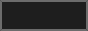</a>'>
<!-- v06 2026-05-20 --></a>'>
<!-- v07 2026-05-20 -->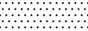</a>'>
<!-- v08 2026-05-20 -->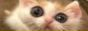</a>'>
<!-- v09 2026-05-20 -->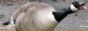</a>'>
<!-- v10 2026-05-20 --></a>'>
<!-- v11 2026-05-20 --></a>'>
<!-- v12 2026-05-20 --></a>'>
<!-- v13 2026-05-20 -->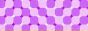</a>'>

<button hidden class="button" onclick="showPanel('all')">All Buttons</button>
<button hidden class="button" onclick="showPanel('categories')">Button Categories</button>

<!-- TEMPLATE
  
-->

  <h2 hidden >All Buttons</h2>
  

  <!-- alpha-# -->
    <!-- 32-Bit Cafe | 2026-05-16 -->
    <a href="https://32bit.cafe/" target="_blank">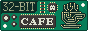</a>
    <!-- 88x31 | 2026-05-16 -->
    
  <!-- alpha-A -->
    <!-- ADHD | 2026-05-15 -->
    
    <!-- Aditya Telange ✌️ | 2026-05-16 -->
    <a href="https://adityatelange.in/" target="_blank">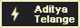</a>
    <!-- Anything but Chrome | 2026-05-15 -->
    
  <!-- alpha-B -->
    <!-- Benji Dog | 2026-05-15 -->
    <a href="https://www.benji.dog/" target="_blank">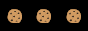</a>
    <!-- Robert Birming ✌️ | 2026-05-16 -->
    
  <!-- alpha-C -->
    <!-- Canada ✌️ | 2026-05-20 -->
    
    <!-- Canadian on the Web | 2026-05-15 -->
    
    <!-- Cinnamoroll 15  | 2026-05-16 -->
    
    <!-- Cinnamoroll 01  | 2026-05-15 -->
    
    <!-- Cinnamoroll 02  | 2026-05-15 -->
    
    <!-- Cinnamoroll 03  | 2026-05-15 -->
    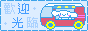
    <!-- Cinnamoroll 04  | 2026-05-15 -->
    
    <!-- Cinnamoroll 05  | 2026-05-15 -->
    
    <!-- Cinnamoroll 06  | 2026-05-15 -->
    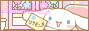
    <!-- HIDDEN - Cinnamoroll 07  | 2026-05-15 -->
    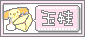
    <!-- Cinnamoroll 08  | 2026-05-15 -->
    
    <!-- Cinnamoroll 09  | 2026-05-15 -->
    
    <!-- Cinnamoroll 10  | 2026-05-15 -->
    
    <!-- Cinnamoroll 11  | 2026-05-15 -->
    
    <!-- Cinnamoroll 12  | 2026-05-15 -->
    
    <!-- Cinnamoroll 13  | 2026-05-15 -->
    
    <!-- HIDDEN - Cinnamoroll 14  | 2026-05-15 -->
    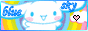
    <!-- Powered by Coffee | 2026-05-16 -->
    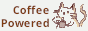
  <!-- alpha-D -->
    <!-- DaFont | 2026-05-15 -->
    
    <!-- Join Discord | 2026-05-15 -->
    <!--  -->
    <!-- Domo | 2026-05-16 -->
    
  <!-- alpha-E -->
    <!-- Eh? | 2026-05-15 -->
    
  <!-- alpha-F -->
    <!-- Firefox | 2026-05-15 -->
    
  <!-- alpha-G -->
    <!-- Gameboy | 2026-05-16 -->
    
    <!-- Get Firefox | 2026-05-15 -->
    
    <!-- Graveyard | 2026-05-15 -->
    
    <!-- GitHub | 2026-05-15 -->
    
    <!-- Glizzy | 2026-05-15 -->
    
  <!-- alpha-H -->
    <!-- Have a Smile | 2026-05-15 -->
    
    <!-- Hellnet.work | 2026-05-16 -->
    <a href="https://hellnet.work/" target="_blank">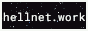</a>
    <!-- Hugo | 2026-05-15 -->
    
  <!-- alpha-I -->
    <!-- I am Canadian | 2026-05-15 -->
    </a>
    <!-- I Hate Squarespace | 2026-05-15 -->
    
    <!-- I Love Horror | 2026-05-17 -->
    
    <!-- Increment | 2026-05-17 -->
    <iframe src="//incr.easrng.net/badge?key=changeme" style="background: url(//incr.easrng.net/bg.gif)" title="increment badge" width="88" height="31" frameborder="0"></iframe>
    <!-- IndieWeb | 2026-05-15 -->
    
    <!-- Internet Archive | 2026-05-15 -->
    
    <!-- ISO 8601 | 2026-05-16 -->
    <a href="https://en.wikipedia.org/wiki/ISO_8601" target="_blank">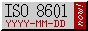</a>
  <!-- alpha-J -->
    <!-- James' Coffee Blog | 2026-05-15 -->
    
    <!-- Johnny Decimal | 2026-05-16 -->
    
    <!-- jshmnrd | 2026-05-15 -->
    
  <!-- alpha-K -->
    <!-- Kool Aid | 2026-05-16 -->
    
    <!-- Korn | 2026-05-16 -->
    
  <!-- alpha-L -->
    <!-- Letterboxd | 2026-05-17 -->
    
  <!-- alpha-M -->
    <!-- Andy Carolan - Made by a Human | 2026-05-16 -->
    
    <!-- Mastodon | 2026-05-15 -->
    
    <!-- Meadow ✌️ | 2026-05-16 -->
    <a href="https://meadow.cafe/" target="_blank">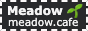</a>
    <!-- Miku Approved | 2026-05-15 -->
    </a>
    <!-- Minecraft | 2026-05-16 -->
    
    <!-- MP3 | 2026-05-16 -->
    <audio id="aah" src="aah.ogg"></audio>
    
  <!-- alpha-N -->
    <!-- Newgrounds | 2026-05-15 -->
    
    <!-- NoAI | 2026-05-16 -->
    <a href="https://chriskirknielsen.com/blog/no-ai-icon-for-humans/" target="_blank">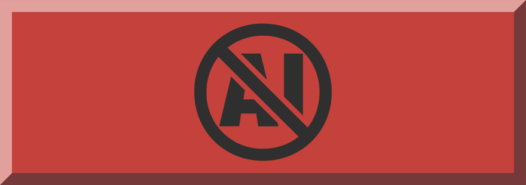</a>
    <!-- NotByAI | 2026-05-15 -->
    
    <!-- Notepad++ | 2026-05-15 -->
    
  <!-- alpha-O -->
    <!-- Open Source | 2026-05-15 -->
    
  <!-- alpha-P -->
    <!-- Pilosophos | 2026-05-16 -->
    
    <!-- Pizza | 2026-05-16 -->
    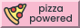
    <!-- Pizzza | 2026-05-15 -->
    
    <!-- Powered by Dr. Pepper | 2026-05-15 -->
    
  <!-- alpha-Q -->
  <!-- alpha-R -->
    <!-- Right to Repair | 2026-05-15 -->
    
    <!-- Robb Knight | 2026-05-16 -->
    <a href="https://rknight.me/" target="_blank">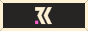</a>
    <!-- RSS | 2026-05-16 -->
    
  <!-- alpha-S -->
    <!-- Scott Games | 2026-05-16 -->
    
    <!-- SCP | 2026-05-15 -->
    
    <!-- Shake Ass ✌️ | 2026-05-20 -->
    
    <!-- Guestbook | 2026-05-16 -->
    
    <!-- Stampbook | 2026-05-16 -->
    <a href="https://stampbook.neocities.org/" target="_blank">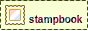</a>
    <!-- Stardew Valley | 2026-05-16 -->
    
    <!-- Star Wars | 2026-05-16 -->
    
    <!-- Stop Killing Games ✌️ | 2026-05-15 -->
    
  <!-- alpha-T -->
    <!-- Terraria | 2026-05-16 -->
    <a href="https://terraria.org/" target="_blank">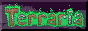</a>
    <!-- Powered by the void | 2026-05-16 -->
    
    <!-- Twitter | 2026-05-16 -->
    
  <!-- alpha-U -->
    <!-- Ukraine | 2026-05-15 -->
    
  <!-- alpha-V -->
    <!-- VHS | 2026-05-16 -->
    
    <!-- VSCode | 2026-05-15 -->
    
  <!-- alpha-W -->
    <!-- Webkinz | 2026-05-16 -->
    
    <!-- White Monster | 2026-05-15 -->
    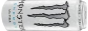
    <!-- Wikipedia | 2026-05-15 -->
    
  <!-- alpha-X -->
    <!-- Windows XP | 2026-05-16 -->
    
  <!-- alpha-Y -->
    <!-- Yoshi Hatch | 2026-05-16 -->
    
  <!-- alpha-Z -->
    <!-- Zimbabwe | 2026-05-15 -->
    
  

<!-- TEMPLATE
  
-->

 <!-- Hidden -->
  <h2>Button Categories</h2>
  <h3>Favourites</h3>
  

    <!-- NotByAI | 2026-05-15 -->
    
    <!-- IndieWeb | 2026-05-15 -->
    
    <!-- Hugo | 2026-05-15 -->
    
    <!-- Powered by Dr. Pepper | 2026-05-15 -->
    
    <!-- ADHD | 2026-05-15 -->
    
    <!-- Miku Approved | 2026-05-15 -->
    </a>
    <!-- Pizzza | 2026-05-15 -->
    
    <!-- Gameboy | 2026-05-16 -->
    
  

  

  <h3>Canadian Pride!</h3>
  

    <!-- Canadian on the Web | 2026-05-15 -->
    
    <!-- I am Canadian | 2026-05-15 -->
    </a>
    <!-- Eh? | 2026-05-15 -->
    
  

  

  <h3>Movements / Causes / Beliefs</h3>
  

    <!-- Anything but Chrome | 2026-05-15 -->
    
    <!-- I Hate Squarespace | 2026-05-15 -->
    
    <!-- Right to Repair | 2026-05-15 -->
    
    <!-- Stop Killing Games ✌️ | 2026-05-15 -->
    
    <!-- Ukraine | 2026-05-15 -->
    
    <!-- Open Source | 2026-05-15 -->
    
    <!-- ISO 8601 | 2026-05-16 -->
    
  

  <h4>Anti-AI</h4>
  

    <!-- NotByAI | 2026-05-15 -->
    
    <!-- NoAI | 2026-05-16 -->
    
    <!-- Andy Carolan - Made by a Human | 2026-05-16 -->
    
  

  

  <h3>People</h3>
  
I don't <i>know</i> any of these people, and they don't know me, but I appreciate them all!

  

    <!-- Aditya Telange ✌️ | 2026-05-16 -->
    
    <!-- Robert Birming ✌️ | 2026-05-16 -->
    
    <!-- Meadow ✌️ | 2026-05-16 -->
    
    <!-- Benji Dog | 2026-05-15 -->
    
    <!-- James' Coffee Blog | 2026-05-15 -->
    
    <!-- Hellnet.work | 2026-05-16 -->
    
    <!-- Pilosophos | 2026-05-16 -->
    
    <!-- Scott Games | 2026-05-16 -->
    
    <!-- Robb Knight | 2026-05-16 -->
    
  

  

  <h3>Tools & Websites</h3>
  

    <!-- 32-Bit Cafe | 2026-05-16 -->
    
    <!-- Stampbook | 2026-05-16 -->
    
    <!-- DaFont | 2026-05-15 -->
    
    <!-- Internet Archive | 2026-05-15 -->
    
    <!-- Mastodon | 2026-05-15 -->
    
    <!-- SCP | 2026-05-15 -->
    
    <!-- Firefox | 2026-05-15 -->
    
    <!-- Get Firefox | 2026-05-15 -->
    
    <!-- GitHub | 2026-05-15 -->
    
    <!-- Newgrounds | 2026-05-15 -->
    
    <!-- Notepad++ | 2026-05-15 -->
    
    <!-- VSCode | 2026-05-15 -->
    
    <!-- Wikipedia | 2026-05-15 -->
    
    <!-- Johnny Decimal | 2026-05-16 -->
    
  

  

  <h3>Cinnamoroll!</h3>
  

    <!-- Cinnamoroll 01  | 2026-05-15 -->
    
    <!-- Cinnamoroll 02  | 2026-05-15 -->
    
    <!-- Cinnamoroll 03  | 2026-05-15 -->
    
    <!-- Cinnamoroll 04  | 2026-05-15 -->
    
    <!-- Cinnamoroll 05  | 2026-05-15 -->
    
    <!-- Cinnamoroll 06  | 2026-05-15 -->
    
    <!-- HIDDEN - Cinnamoroll 07  | 2026-05-15 -->
    
    <!-- Cinnamoroll 08  | 2026-05-15 -->
    
    <!-- Cinnamoroll 09  | 2026-05-15 -->
    
    <!-- Cinnamoroll 10  | 2026-05-15 -->
    
    <!-- Cinnamoroll 11  | 2026-05-15 -->
    
    <!-- Cinnamoroll 12  | 2026-05-15 -->
    
    <!-- Cinnamoroll 13  | 2026-05-15 -->
    
    <!-- HIDDEN - Cinnamoroll 14  | 2026-05-15 -->
    
    <!-- Cinnamoroll 15  | 2026-05-16 -->
    
  

  

  <h3>Games</h3>
  

    <!-- Minecraft | 2026-05-16 -->
    
    <!-- Terraria | 2026-05-16 -->
    
    <!-- Stardew Valley | 2026-05-16 -->
    
  

  

  <h3>Other</h3>
  

    <!-- Have a Smile | 2026-05-15 -->
    
    <!-- White Monster | 2026-05-15 -->
    
    <!-- Join Discord | 2026-05-15 -->
    <!--  -->
    <!-- Domo | 2026-05-16 -->
    
    <!-- Graveyard | 2026-05-15 -->
    
    <!-- Glizzy | 2026-05-15 -->
    
    <!-- Kool Aid | 2026-05-16 -->
    
    <!-- Korn | 2026-05-16 -->
    
    <!-- MP3 | 2026-05-16 -->
    <audio id="aah" src="aah.ogg"></audio>
    
    <!-- RSS | 2026-05-16 -->
    
    <!-- Star Wars | 2026-05-16 -->
    
    <!-- Powered by the void | 2026-05-16 -->
    
    <!-- Twitter | 2026-05-16 -->
    
    <!-- VHS | 2026-05-16 -->
    
    <!-- Webkinz | 2026-05-16 -->
    
    <!-- Windows XP | 2026-05-16 -->
    
    <!-- Yoshi Hatch | 2026-05-16 -->
    
    <!-- Pizza | 2026-05-16 -->
    
    <!-- Guestbook | 2026-05-16 -->
    
    <!-- Zimbabwe | 2026-05-15 -->
    
    <!-- Powered by Coffee | 2026-05-16 -->
    
  

<!-- TEMPLATE
  
-->

<i>More to come!</i>

