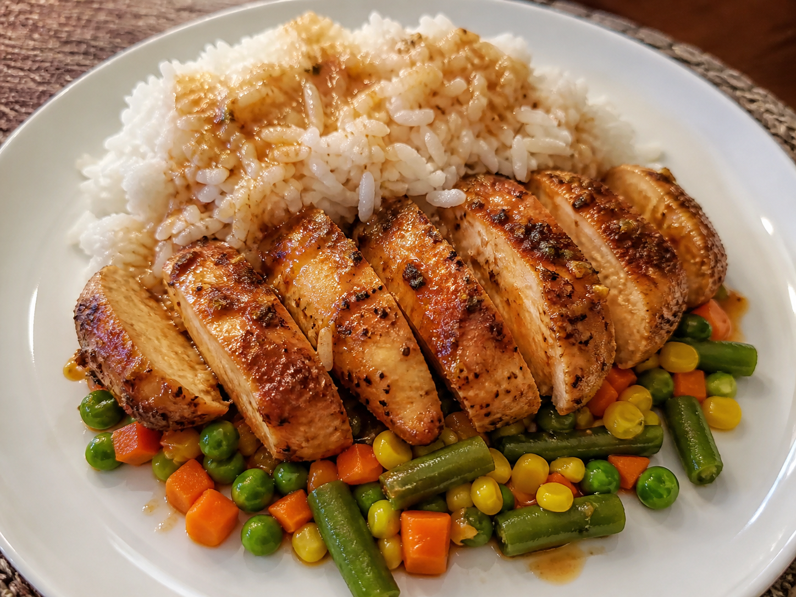

A simple spicy chicken dinner served over vegetables and rice, finished with the pan juices drizzled on top.

# Ingredients

* Chicken breasts, as many as needed
* 2 tbsp cooking oil per 2 chicken breasts, olive oil recommended
* Huy Fong's Sriracha, to taste
* Rice, cooked according to package directions
* Frozen mixed vegetables

# Directions

1. **Prepare the chicken**
   Slice each chicken breast horizontally in half so each piece is about half the original thickness. This helps the chicken cook faster and more evenly.

2. **Prepare the pan**
   Add about 2 tbsp of cooking oil to a frying pan, enough to lightly coat the bottom.

3. **Season the base**
   Zigzag sriracha sauce, to taste, directly into the oil. Use more or less depending on your spice preference.

4. **Add the chicken**
   Place the chicken pieces into the pan, then season the top side with a little more Sriracha.

5. **Cook the chicken**
   Cook over medium-high heat until the chicken is fully cooked through.

   * If starting with a cold pan: cook about **8 minutes on the first side**, then **6 minutes on the second side**.
   * If the pan is already warm: cook about **6 minutes per side**.

   The chicken is done when it reaches an internal temperature of **165°F / 74°C**.

6. **Cook the rice**
   Once the chicken starts cooking, begin preparing your rice according to the package directions. Make as much as you need.

7. **Cook the vegetables**
   After flipping the chicken, add the frozen vegetables to a pot and cover with water by about 3 cm. Bring to a boil and cook until heated through and tender. Drain before serving.

# Plating

To serve, layer the plate in this order:

1. Vegetables on the bottom
2. Chicken in the middle
3. Rice on top

Finish by drizzling the pan juices from the chicken over the rice like a spicy gravy.

# Optional Recipe Note

For best results, slice the chicken evenly and avoid moving it around too much while it cooks. Letting it sit in the pan helps it brown and build flavour in the oil & Sriracha.